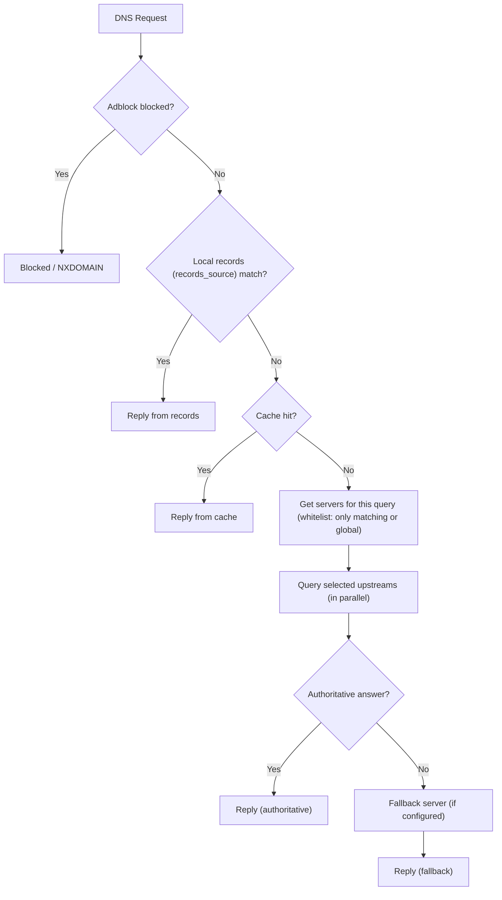

# dnsplane


A non-standard DNS server with multiple management interfaces (TUI, API). It queries local records, cache, and all configured upstream DNS servers (plus an optional fallback) **in parallel**, then replies by priority: local data wins, then cache, then any authoritative upstream answer, then the first successful upstream answer. This fits setups where you have a local DNS server and use work DNS over VPN at the same time—authoritative answers (e.g. from the work server) are preferred when present; otherwise you get the fastest successful reply from any server.

## Resolution behavior

- **Parallel lookups:** For each A-record query, dnsplane runs **at the same time**: local records (dnsrecords.json), cache (dnscache.json), and every configured upstream—plus the fallback server when it is different from the upstreams. The reply is chosen by priority; there is no second round of queries.
- **Priority:** (1) Local records, (2) cache, (3) any upstream that returned an **authoritative** answer, (4) the **first** successful answer from any upstream. If fallback is the same as an upstream, it is not queried twice; that server’s reply is used like any other upstream.
- **Recursive resolvers:** Answers from resolvers like 1.1.1.1 (which are not authoritative for the domain) are accepted as “first success”; the server no longer waits for an authoritative reply and then re-querying fallback, so latency stays low (e.g. ~5–7 ms when the upstream is fast).
- **Reply path:** The DNS reply is sent as soon as it is ready. Logging, stats, and cache persistence run asynchronously so they do not block the response.
- **Domain whitelist (per-server):** An upstream can have an optional **domain whitelist**. If set, that server is used **only** for query names that match one of the listed suffixes (exact or subdomain). For example, a server with whitelist `example.com,example.org` receives only queries for those domains and their subdomains; all other queries use only “global” upstreams (servers with no whitelist). Whitelisted domains are resolved **only** via those servers (no fallback to global upstreams). In the TUI: `dns add 192.168.5.5 53 active:true localresolver:true adblocker:false whitelist:example.com,example.org`.

## Diagram

Resolution flow including adblock, local records (file/URL/git), cache, per-server domain whitelist, and fallback:



- **Adblock:** Query name checked against block list first; if blocked, no upstream is used.
- **Local records:** Loaded from `records_source` (file, URL, or Git). If a record matches, that reply is used and upstreams are not queried.
- **Cache:** If caching is enabled and the answer is still valid, it is returned without querying upstreams.
- **Server selection:** `GetServersForQuery` picks upstreams for this name: servers with a matching domain whitelist, or (if none match) only global servers. Whitelisted domains are resolved only via their servers.
- **Upstreams + fallback:** Selected servers are queried in parallel; priority is authoritative answer, then first success. Fallback is used only when the selected list is “global” and no authoritative answer was returned.


## Usage/Examples

dnsplane has two commands: **server** (run the DNS server and TUI/API listeners) and **client** (connect to a running server). The `--config` flag applies only to the **server** command.

### start as daemon (server)
```bash
./dnsplane server
```
The daemon keeps the resolver running, exposes the UNIX control socket at `/tmp/dnsplane.socket`, and listens for remote TUI clients on TCP port `8053` by default.

### start in client mode (connects to the default unix socket unless overridden)
```bash
./dnsplane client
# or specify a custom socket path
./dnsplane client /tmp/dnsplane.sock
./dnsplane client --client /tmp/dnsplane.sock
```

### connect to a remote resolver over TCP (default port 8053)
```bash
./dnsplane client 192.168.178.40
./dnsplane client 192.168.178.40:8053
```

### change the server socket path (server command)
```bash
./dnsplane server --server-socket /tmp/custom.sock
```

### change the TCP TUI listener (server command)
```bash
./dnsplane server --server-tcp 0.0.0.0:9000
```

### config and data file paths
When you do not pass any path flags, dnsplane looks for an existing `dnsplane.json` in the executable directory, then the user config dir (e.g. `~/.config/dnsplane/`), then `/etc/dnsplane.json`. If none is found, it creates the config and data files in the **current directory only** (never in `/etc` or elsewhere). You can override the config file and the JSON data files with server flags:

```bash
./dnsplane server --config ./myconfig.json --dnsrecords ./records.json --cache ./cache.json --dnsservers ./servers.json
```

| Flag | Purpose |
| --- | --- |
| `--config` | Path to config file; if the file does not exist, a default config is created there (server only) |
| `--dnsservers` | Path to dnsservers.json (overrides config) |
| `--dnsrecords` | Path to dnsrecords.json (overrides config) |
| `--cache` | Path to dnscache.json (overrides config) |

If a data file does not exist, dnsplane creates it with default contents at the configured (or overridden) path. When the records source is URL or Git, no local records file is created (records are read-only from the remote source).

### TUI (interactive client)

When you run `dnsplane client` (or connect over TCP), you get an interactive TUI. Main areas:

- **record** – Add, remove, update, list DNS records (`record add <name> [type] <value> [ttl]`, etc.).
- **dns** – Manage upstream DNS servers: add, update, remove, list, clear, load, save. Use named params: `dns add 1.1.1.1 53`, `dns add 192.168.5.5 53 active:true adblocker:false whitelist:example.com,example.org`.
- **server** – **config** (show all settings), **set** (e.g. `server set apiport 8080`; in-memory until you run **save**), **save** (write config to disk), **load** (reload config from disk), **start** / **stop** (dns, api, or client listeners), **status**, **version**.
- **adblock** – **load** &lt;file or URL&gt; (merge into block list), **list** (loaded sources and counts), **domains** (list blocked domains), **add** / **remove** / **clear**.
- **tools** – **dig** (e.g. `tools dig example.com`, `tools dig example.com @8.8.8.8`).
- **cache** – List, clear cache.
- **stats** – Query counts, cache hits, block list size, runtime stats.
- **statistics** – View aggregated data from the full_stats DB: `statistics requesters [full]` (top requesters by IP, or all with `full`), `statistics domains [full]` (top domains, or all). Requires `full_stats: true` in config.

Use `?` or `help` after a command in the TUI for usage.

### Recording of clearing and adding dns records
https://github.com/user-attachments/assets/f5ca52cb-3874-499c-a594-ba3bf64b3ba9


## Config Files

| File | Usage |
| --- | --- |
| dnsrecords.json | holds dns records |
| dnsservers.json | holds the dns servers used for queries |
| dnscache.json | holds queries already done if their ttl diff is still above 0 |
| dnsplane.json | the app config |

### Records source (file, URL, or Git)

DNS records are always configured via `file_locations.records_source` in `dnsplane.json`. One source type applies for both loading and (when writable) saving:

- **file** – Local path; records are read from and written to this path (e.g. `dnsrecords.json`). Default.
- **url** – HTTP(S) URL that returns JSON in the same format as the records file (`{"records": [...]}`). Read-only; a refresh interval controls how often dnsplane re-fetches.
- **git** – Git repository URL (HTTPS or SSH). dnsplane clones/pulls the repo and reads `dnsrecords.json` at the **root**. Read-only; refresh interval controls how often it runs `git pull`.

When using **url** or **git**, the TUI and API can still add/update/remove records in memory, but changes are overwritten on the next refresh.

Example – local file (default):

```json
"file_locations": {
  "dnsservers": "/etc/dnsplane/dnsservers.json",
  "cache": "/etc/dnsplane/dnscache.json",
  "records_source": {
    "type": "file",
    "location": "/etc/dnsplane/dnsrecords.json"
  }
}
```

Example – URL (read-only):

```json
"records_source": {
  "type": "url",
  "location": "https://example.com/dnsrecords.json",
  "refresh_interval_seconds": 60
}
```

Example – Git (read-only):

```json
"records_source": {
  "type": "git",
  "location": "https://github.com/you/repo.git",
  "refresh_interval_seconds": 120
}
```

For **url** and **git**, `refresh_interval_seconds` defaults to 60 if omitted.

### Adblock lists

Blocked domains are stored in a single in-memory list. You can:

- **TUI:** `adblock load <filepath|url>` (one file or URL per command; each load is merged), `adblock list` (sources and count per source), `adblock domains` (all blocked domains), `adblock add` / `adblock remove` / `adblock clear`.
- **Config:** In `dnsplane.json`, set `adblock_list_files` to an array of paths. Those files are loaded in order at startup and merged into the block list (same hosts-style format: `0.0.0.0 domain1.com domain2.com`). Stats show "Adblock list: N domains".

### Main config options (dnsplane.json)

Besides `file_locations` (and `records_source`, `adblock_list_files`), the config supports:

- **DNS / fallback:** `port`, `apiport`, `fallback_server_ip`, `fallback_server_port`, `timeout`
- **API:** `api` (bool), `apiport`
- **Client access:** `server_socket` (UNIX socket), `server_tcp` (TCP address for remote TUI clients)
- **Behaviour:** `cache_records`, `full_stats`, `full_stats_dir`
- **DNSRecordSettings:** `auto_build_ptr_from_a`, `forward_ptr_queries`, `add_updates_records`
- **Log:** `log_dir`, `log_severity`, `log_rotation`, `log_rotation_size_mb`, `log_rotation_time_days`

Use `server config` in the TUI to print all current settings, and `server set <setting> <value>` then `server save` to change and persist them.

### REST API

Enable the REST API with `"api": true` in `dnsplane.json` and set `apiport` (e.g. `8080`). You can start or stop the API listener from the TUI with `server start api` / `server stop api`.

| Method | Path | Description |
| --- | --- | --- |
| GET | `/health` | Liveness: returns 200 when the API process is up. No dependency on DNS or other listeners. |
| GET | `/ready` | Readiness: returns 200 when the API and DNS listener are both up, 503 otherwise. Response is JSON with `ready`, `api`, `dns`, `tui_client` (connected, addr, since), and `listeners` (dns_port, api_port, api_enabled, client_socket_path, client_tcp_address). Useful for Kubernetes readiness probes and load balancers. |
| GET | `/dns/records` | List DNS records (same data as the TUI). Returns JSON with `records` and optional `filter`, `messages`. |
| POST | `/dns/records` | Add a DNS record. Body: `{"name":"...","type":"A","value":"...","ttl":3600}`. |
| GET | `/dns/servers` | List configured upstream DNS servers (read-only). Returns JSON `{"servers":[...]}` with address, port, active, local_resolver, adblocker, domain_whitelist, last_used, last_success. |
| GET | `/stats` | Resolver stats as JSON: total_queries, total_cache_hits, total_blocks, total_queries_forwarded, total_queries_answered, server_start_time. When `full_stats` is enabled in config, includes `full_stats.enabled`, `full_stats.requesters_count`, `full_stats.domains_count`. |
| GET | `/metrics` | Prometheus text format: counters (e.g. `dnsplane_queries_total`, `dnsplane_cache_hits_total`, `dnsplane_blocks_total`) and gauges (`dnsplane_server_start_time_seconds`). When full_stats is enabled, adds `dnsplane_fullstats_requesters_count` and `dnsplane_fullstats_domains_count`. |
| GET | `/stats/page` | Read-only stats dashboard (HTML): dark-themed page with panels for resolver stats, data counts, status (API/DNS/TUI client, listeners), and when full_stats is enabled a Full stats panel with requesters/domains counts and top 10 requesters and top 10 domains. Use query `?full=N` (e.g. `?full=20`) to show top N instead of 10. |

## Logging

**Server:** Logging is configured in `dnsplane.json` under a `log` section. By default logs are written to `/var/log/dnsplane/` with fixed filenames: `dnsserver.log`, `apiserver.log`, and `tuiserver.log`. You can set:

- `log_dir` – directory for log files (default: `/var/log/dnsplane`)
- `log_severity` – minimum level: `debug`, `info`, `warn`, or `error`; or `none` to disable logging (no log files are created). Default is `none`.
- `log_rotation` – `none`, `size`, or `time`
- `log_rotation_size_mb` – max size in MB before rotation (when rotation is `size`)
- `log_rotation_time_days` – max age in days before rotation (when rotation is `time`)

Rotation is checked at most every 5 minutes to avoid repeated stat calls. If writing to a log file fails, the process keeps running and the message is written to stderr.

**Client:** File logging is off by default. Use `--log-file` to enable it; you can pass a file path or a directory (in which case the file is named `dnsplaneclient.log`).

## Running as a systemd service

A systemd unit file is provided under `systemd/dnsplane.service`. It runs the binary from `/usr/local/dnsplane/` with the **server** command and **explicitly** passes config and data paths under `/etc/dnsplane/` (via `--config` and server flags `--dnsservers`, `--dnsrecords`, `--cache`). dnsplane does not use or create files in `/etc` by default; that only happens when you use this service file or pass those paths yourself.

1. Install the binary: place the `dnsplane` executable at `/usr/local/dnsplane/dnsplane`.
2. Copy the unit file: `cp systemd/dnsplane.service /etc/systemd/system/`.
3. Create the config directory: `mkdir -p /etc/dnsplane`.
4. Reload and enable: `systemctl daemon-reload && systemctl enable --now dnsplane.service`.

When the service runs, it will create default `dnsplane.json` and JSON data files in `/etc/dnsplane/` if they are missing, because the unit file passes those paths. Ensure the service user (e.g. root) can write to that directory for the first start.

## Roadmap

- Ad-blocking (implemented; load from file or URL, merge multiple lists, config `adblock_list_files`)
- Full stats tracking (implemented; optional, see config)
- Per-server domain whitelist (implemented; `dns add/update` with `whitelist:example.com,example.org`)
- Records from URL or Git (implemented; read-only, with refresh interval)
- Server config/set/save and start/stop (dns, api, client) in TUI (implemented)

0.2.x adds shutdown timeouts for systemd, the **statistics** TUI (requesters/domains from full_stats), and build info (Go version, OS, arch) in `stats`.

## Dependencies & Documentation
[](https://snyk.io/test/github/network-plane/dnsplane)
[](https://qlty.sh/gh/network-plane/projects/dnsplane)

[](https://www.bestpractices.dev/projects/8887)
[](https://securityscorecards.dev/viewer/?uri=github.com/network-plane/dnsplane)
[](https://www.bestpractices.dev/projects/8887)


[]()
[](https://pkg.go.dev/github.com/network-plane/dnsplane)
[](https://libraries.io/github/network-plane/dnsplane)


## Contributing

Contributions are always welcome!
All contributions are required to follow the https://google.github.io/styleguide/go/

## Commit Activity


## Authors

- [@earentir](https://www.github.com/earentir)


## License

I will always follow the Linux Kernel License as primary, if you require any other OPEN license please let me know and I will try to accomodate it.

[](https://opensource.org/license/gpl-2-0)
