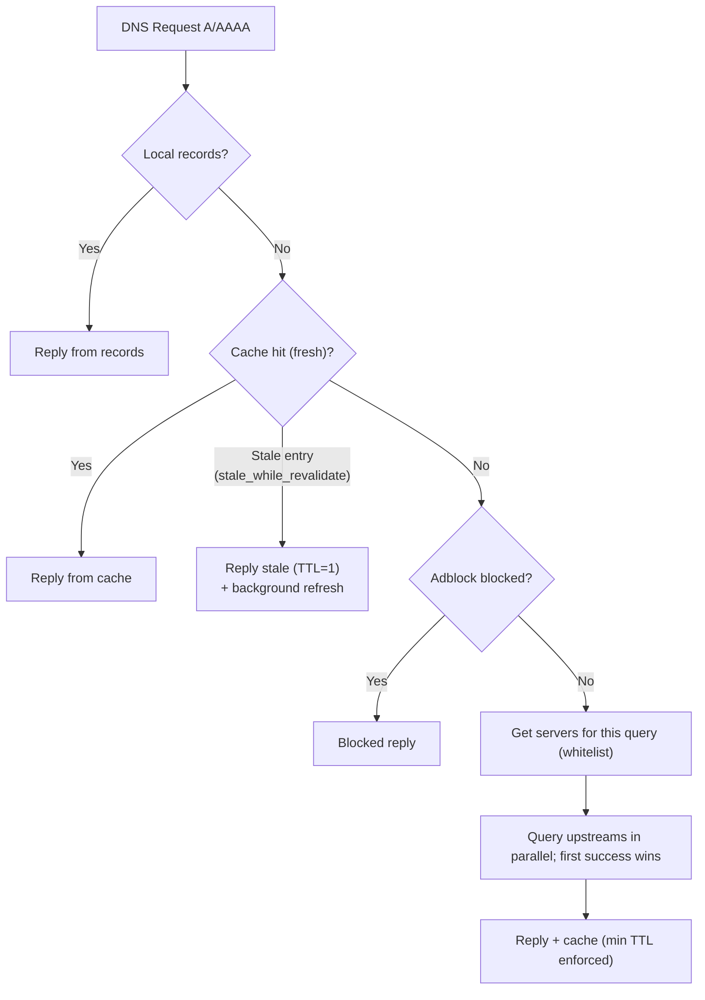

# dnsplane


A DNS server with a TUI and REST API. For common record types (**A**, **AAAA**, **MX**, …) answers come from **local records**, then **cache** (if enabled), then **upstreams** queried in parallel; the first successful upstream wins. **PTR** uses local data (including PTR synthesized from **A**) first, then the same path on miss. Optional Linux host tuning: [docs/host-tuning.md](docs/host-tuning.md).

## Resolution behavior

- **Fast path (A, AAAA, MX, …):** Try **local records**, then **cache** (if enabled). If neither applies, query **all upstreams in parallel** and use the **first successful** answer; slower or duplicate upstream work is cancelled once a winner returns.
- **PTR:** Local first (full scan + optional **A**→PTR synthesis), then the same fast path if no local answer.
- **Priority:** Local > cache > first upstream success.
- **Recursive resolvers:** Public resolvers (e.g. 1.1.1.1) return a usable answer quickly; dnsplane uses the first successful upstream response rather than waiting for a different resolution path, which keeps typical latency low.
- **Reply path:** The client gets an answer as soon as it is ready. Logging, stats, and saving the cache file happen in the background and do not delay the reply.
- **Cache behavior:** On a hit, local and cache are checked before any upstream work. **`min_cache_ttl_seconds`** (default 600) avoids caching answers with very short TTLs as-is. **`stale_while_revalidate`** can serve a stale answer immediately (TTL=1) while refreshing from upstream in the background.
- **Cache warm:** With **`cache_warm_enabled`** on (default), the server sends a periodic lightweight query to itself so idle systems stay responsive (**`cache_warm_interval_seconds`**, default 10).
- **Cache compaction:** With **`cache_compact_enabled`** on (default) and **`cache_records`** on, expired rows are removed from the cache on a schedule (**`cache_compact_interval_seconds`**, default 1800s; minimum 60). The dashboard can show cache size and the next compaction when this is enabled.
- **A/AAAA vs adblock:** Local and cache are checked **before** the blocklist so a cache hit does not run the blocklist. After a cache miss, blocked names still get the block reply. If a name is blocked but already has a **positive** cache entry, that answer is served until TTL (flush cache if you need the blocklist to take effect immediately).
- **Domain whitelist (per-server):** An upstream can have an optional **domain whitelist**. If set, that server is used **only** for query names that match one of the listed suffixes (exact or subdomain). For example, a server with whitelist `example.com,example.org` receives only queries for those domains and their subdomains; all other queries use only “global” upstreams (servers with no whitelist). Whitelisted domains are resolved **only** via those servers (no fallback to global upstreams). In the TUI: `dns add 192.168.5.5 53 active:true localresolver:true adblocker:false whitelist:example.com,example.org`.

## Diagram

Resolution flow including adblock, local records (file/URL/git), cache, per-server domain whitelist, and fallback:


```mermaid
flowchart TD
    REQ["DNS Request A/AAAA"]
    REQ --> RECORDS{"Local records?"}
    RECORDS -->|Yes| REPLY_R["Reply from records"]
    RECORDS -->|No| CACHE{"Cache hit (fresh)?"}
    CACHE -->|Yes| REPLY_C["Reply from cache"]
    CACHE -->|"Stale entry\n(stale_while_revalidate)"| STALE["Reply stale (TTL=1)\n+ background refresh"]
    CACHE -->|No| ADBLOCK{"Adblock blocked?"}
    ADBLOCK -->|Yes| BLOCK["Blocked reply"]
    ADBLOCK -->|No| SELECT["Get servers for this query (whitelist)"]
    SELECT --> UPSTREAM["Query upstreams in parallel; first success wins"]
    UPSTREAM --> REPLY_A["Reply + cache (min TTL enforced)"]
```

- **Adblock (A/AAAA):** After local/cache miss, the name is checked against the block list; if blocked, no upstream is used.
- **Local records:** Loaded from `records_source` (file, URL, or Git). If a record matches, that reply is used and upstreams are not queried.
- **Cache:** If caching is enabled and the answer is still valid, it is returned without querying upstreams. When `stale_while_revalidate` is enabled, expired entries are served immediately (TTL=1) while a background refresh runs against upstream.
- **Min TTL:** Upstream answers are cached with `max(original TTL, min_cache_ttl_seconds)` so short-TTL domains don't cause frequent cache misses.
- **Server selection:** For each query name, dnsplane chooses upstreams with a matching **domain whitelist** if any; otherwise it uses only “global” upstreams (no whitelist). Names that match a whitelist are sent only to those servers.
- **Upstreams:** First successful reply wins for the fast path (all QTYPEs above).

## Additional documentation

| Doc | What it covers |
|-----|----------------|
| **[docs/host-tuning.md](docs/host-tuning.md)** | Optional **Linux OS / host tuning** for DNS latency: UDP buffer sizes, open-file limits, CPU governor, containers, and how to measure. |
| **[docs/upstream-health.md](docs/upstream-health.md)** | **Upstream health checks**: periodic probes, marking servers down, config keys, logs, and **curl** examples. |
| **[docs/clustering.md](docs/clustering.md)** | **Multi-node record sync**: TCP peer protocol, `cluster_*` config keys, auth token, sequences, deployment notes. |
| **[docs/dnsplane.example.json](docs/dnsplane.example.json)** | Full example `dnsplane.json` with documented keys and defaults (adjust paths for your install). |
| **[examples/dnsplane-example.json](examples/dnsplane-example.json)** | Small starter `dnsplane.json` (DoT / DoH / DNSSEC present, off by default). Includes **`dashboard_resolution_log_cap`** for the dashboard Resolutions log. |
| **[examples/dnsservers-example.json](examples/dnsservers-example.json)** | Example `dnsservers.json` with a global upstream and split DNS via **`domain_whitelist`**. |
| **[examples/curl-stats-dashboard.sh](examples/curl-stats-dashboard.sh)** | **`curl`** examples for `/stats/dashboard`, `/stats/dashboard/data`, and `/stats/dashboard/resolutions`. |
| **[examples/README.md](examples/README.md)** | Index of example files and how they relate to **`docs/dnsplane.example.json`**. |

DoT, DoH, and DNSSEC options are summarized in [docs/security-public-dns.md](docs/security-public-dns.md) and in the config tables under [Main config options](#main-config-options-dnsplanejson). Upcoming work is listed in [TODO.md](TODO.md).

## Usage/Examples

dnsplane has two commands: **server** (run the DNS server and TUI/API listeners) and **client** (connect to a running server). The `--config` flag applies only to the **server** command.

**Version:** `/version`, `/ready`, and the TUI banner report the version string baked into the binary you are running.

### start as daemon (server)
```bash
./dnsplane server
```
The daemon keeps the resolver running, exposes a UNIX control socket for the TUI (path depends on OS and user—see **Defaults and non-root** under [config and data file paths](#config-and-data-file-paths)), and listens for remote TUI clients on TCP port `8053` by default.

### start in client mode (connects to the default unix socket unless overridden)
```bash
./dnsplane client
# or specify a custom socket path or address
./dnsplane client /tmp/dnsplane.sock
```

### connect to a remote resolver over TCP (default port 8053)
```bash
./dnsplane client 192.168.178.40
./dnsplane client 192.168.178.40:8053
```

### change the server socket path (server command)
```bash
./dnsplane server --server-socket /tmp/custom.sock
```

### change the TCP TUI listener (server command)
```bash
./dnsplane server --server-tcp 0.0.0.0:9000
```

### config and data file paths
When you do not pass any path flags, dnsplane looks for an existing `dnsplane.json` in the executable directory, then the user config dir (e.g. `~/.config/dnsplane/`), then `/etc/dnsplane.json`. If none is found, it creates the config and data files in the **current directory only** (never in `/etc` or elsewhere). You can override the config file and the JSON data files with server flags:

```bash
./dnsplane server --config ./myconfig.json --dnsrecords ./records.json --cache ./cache.json --dnsservers ./servers.json
```

| Flag | Purpose |
| --- | --- |
| `--config` | Path to config file; if the file does not exist, a default config is created there (server only) |
| `--dnsservers` | Path to dnsservers.json (overrides config) |
| `--dnsrecords` | Path to dnsrecords.json (overrides config) |
| `--cache` | Path to dnscache.json (overrides config) |

If a data file does not exist, dnsplane creates it with default contents at the configured (or overridden) path. When the records source is URL or Git, no local records file is created (records are read-only from the remote source).

**Log directory (defaults):** If your config directory is **not** under `/etc`, the default log folder is `log` next to that directory (e.g. `./log` or `~/.config/dnsplane/log`). If the config directory **is** under `/etc`, the default log directory is `/var/log/dnsplane`.

**UNIX socket (defaults):** The server and client use the same path unless you set `--server-socket`. **Running as root:** the socket is under the OS temp directory (on Linux this is often `/tmp/dnsplane.socket`). **Not root:** `$XDG_RUNTIME_DIR/dnsplane.socket` if set; otherwise `dnsplane/dnsplane.socket` under the user config directory (Linux: typically `~/.config/dnsplane/`; macOS: `~/Library/Application Support/dnsplane/`). That way each unprivileged user gets their own socket by default.

### TUI (interactive client)

When you run `dnsplane client` (or connect over TCP), you get an interactive TUI. Main areas:

- **record** – Add, remove, update, list DNS records (`record add <name> [type] <value> [ttl]`, etc.).
- **dns** – Manage upstream DNS servers: add, update, remove, list, clear, load, save. Use named params: `dns add 1.1.1.1 53`, `dns add 192.168.5.5 53 active:true adblocker:false whitelist:example.com,example.org`.
- **server** – **config** (show all settings), **set** (e.g. `server set apiport 8080`; in-memory until you run **save**), **save** (write config to disk), **load** (reload config from disk), **start** / **stop** (dns, api, or client listeners), **status**, **version**.
- **adblock** – **load** &lt;file or URL&gt; (merge into block list), **list** (loaded sources and counts), **domains** (list blocked domains), **add** / **remove** / **clear**.
- **tools** – **dig** (e.g. `tools dig example.com`, `tools dig example.com @8.8.8.8`).
- **cache** – `cache list`, **`cache clear`** (empty in-memory cache; **`cache save`** to persist `dnscache.json`), `cache load` / `cache save`, `cache remove …`.
- **stats** – Query counts, cache hits, block list size, runtime stats.
- **statistics** – View aggregated data from the full_stats DB: `statistics requesters [full]`, `statistics domains [full]`, **`statistics clear`** (wipe DB + session counters), **`statistics save`** (flush `stats.db` to disk, like `cache save` after `cache clear`). Requires `full_stats: true` in config.

Use `?` or `help` after a command in the TUI for usage.

### Demo (TUI: records)

https://github.com/user-attachments/assets/f5ca52cb-3874-499c-a594-ba3bf64b3ba9

## Config Files

| File | Usage |
| --- | --- |
| dnsrecords.json | holds dns records |
| dnsservers.json | holds the dns servers used for queries (see [Upstream servers and domain whitelist](#upstream-servers-dnsserversjson-and-domain-whitelist)) |
| dnscache.json | Cached answers while still valid (TTL not expired), when caching is enabled |
| dnsplane.json | the app config |

Starter copies in the repo: **[examples/dnsplane-example.json](examples/dnsplane-example.json)** and **[examples/dnsservers-example.json](examples/dnsservers-example.json)** (point `file_locations.dnsservers` at your real path, e.g. `./dnsservers.json`).

### Records source (file, URL, or Git)

DNS records are always configured via `file_locations.records_source` in `dnsplane.json`. One source type applies for both loading and (when writable) saving:

- **file** – Local path; records are read from and written to this path (e.g. `dnsrecords.json`). Default.
- **url** – HTTP(S) URL that returns JSON in the same format as the records file (`{"records": [...]}`). Read-only; a refresh interval controls how often dnsplane re-fetches.
- **git** – Git repository URL (HTTPS or SSH). dnsplane clones/pulls the repo and reads `dnsrecords.json` at the **root**. Read-only; refresh interval controls how often it runs `git pull`.

When using **url** or **git**, the TUI and API can still add/update/remove records in memory, but changes are overwritten on the next refresh.

Example – local file (default):

```json
"file_locations": {
  "dnsservers": "/etc/dnsplane/dnsservers.json",
  "cache": "/etc/dnsplane/dnscache.json",
  "records_source": {
    "type": "file",
    "location": "/etc/dnsplane/dnsrecords.json"
  }
}
```

Example – URL (read-only):

```json
"records_source": {
  "type": "url",
  "location": "https://example.com/dnsrecords.json",
  "refresh_interval_seconds": 60
}
```

Example – Git (read-only):

```json
"records_source": {
  "type": "git",
  "location": "https://github.com/you/repo.git",
  "refresh_interval_seconds": 120
}
```

For **url** and **git**, `refresh_interval_seconds` defaults to 60 if omitted.

### Upstream servers (`dnsservers.json`) and domain whitelist

The file is JSON: **`{ "dnsservers": [ ... ] }`**. Each entry has at least `address`, `port`, `active`, `local_resolver`, `adblocker`. Optional: `transport` (`udp` / `tcp` / `dot` / `doh`), `doh_url` for DoH.

**`domain_whitelist`** (optional array of strings): if set, this upstream is used **only** for query names that match an entry (exact name or a subdomain under that suffix). Names that match **any** active whitelisted server are resolved **only** via those servers — **not** via global upstreams (no `domain_whitelist`) and **not** via the configured **`fallback_server_*`** for that query. You can list **multiple** suffixes on one server, or use **multiple** server rows each with its own whitelist and IP.

Example (same structure as **[examples/dnsservers-example.json](examples/dnsservers-example.json)**):

```json
{
  "dnsservers": [
    {
      "address": "1.1.1.1",
      "port": "53",
      "active": true,
      "local_resolver": true,
      "adblocker": false
    },
    {
      "address": "10.0.0.53",
      "port": "53",
      "active": true,
      "local_resolver": true,
      "adblocker": false,
      "domain_whitelist": ["internal.example.com", "corp.other.net"]
    }
  ]
}
```

TUI equivalent for the internal row:
`dns add 10.0.0.53 53 active:true localresolver:true adblocker:false whitelist:internal.example.com,corp.other.net`

See also the [Resolution behavior](#resolution-behavior) bullets on **Domain whitelist** and **Server selection**.

### Adblock lists

Blocked domains are stored in a single in-memory list. You can:

- **TUI:** `adblock load <filepath|url>` (one file or URL per command; each load is merged), `adblock list` (sources and count per source), `adblock domains` (all blocked domains), `adblock add` / `adblock remove` / `adblock clear`.
- **Config:** In `dnsplane.json`, set `adblock_list_files` to an array of paths. Those files are loaded in order at startup and merged into the block list (same hosts-style format: `0.0.0.0 domain1.com domain2.com`). Stats show "Adblock list: N domains".

### Main config options (`dnsplane.json`)

See **[docs/dnsplane.example.json](docs/dnsplane.example.json)** for every key and defaults. **[examples/dnsplane-example.json](examples/dnsplane-example.json)** is a shorter starter. Upstreams and **`domain_whitelist`** are covered in **[examples/dnsservers-example.json](examples/dnsservers-example.json)** and [Upstream servers (`dnsservers.json`)](#upstream-servers-dnsserversjson-and-domain-whitelist). The tables below group the same options for quick lookup.

**DNS and fallback**

| Key | Meaning |
| --- | --- |
| `port` | DNS UDP/TCP listen port (default `53`). |
| `dns_bind` | IP to bind for DNS (empty = all interfaces). |
| `fallback_server_ip`, `fallback_server_port` | Resolver used when no upstream matches or for recursion-style paths. |
| `timeout` | Upstream query timeout (seconds). |
| `fallback_server_transport` | `udp` (default), `tcp`, `dot`, or `doh` for the fallback resolver. |
| `dns_refuse_any` | If true, answer NOTIMP for `ANY` queries. |
| `dns_max_edns_udp_payload` | Cap EDNS UDP payload on responses (`0` = unchanged; e.g. `1232`). |

**REST API and client access**

| Key | Meaning |
| --- | --- |
| `api` | Enable REST API listener. |
| `apiport` | API listen port (e.g. `8080`). |
| `api_bind` | API bind address (empty = all interfaces). |
| `api_auth_token` | If set, requires `Authorization: Bearer` or `X-API-Token` except `GET/HEAD /health` and `/ready`. |
| `api_tls_cert`, `api_tls_key` | PEM paths; both set → HTTPS for the API. |
| `api_rate_limit_rps`, `api_rate_limit_burst` | Per-client HTTP rate limit (`0` RPS = disabled). |
| `server_socket` | UNIX socket for TUI control. |
| `server_tcp` | TCP address for remote TUI clients (default `0.0.0.0:8053`). |

**DoT / DoH (inbound)**

| Key | Meaning |
| --- | --- |
| `dot_enabled`, `dot_bind`, `dot_port`, `dot_cert_file`, `dot_key_file` | DNS over TLS listener. |
| `doh_enabled`, `doh_bind`, `doh_port`, `doh_path`, `doh_cert_file`, `doh_key_file` | DNS over HTTPS. |

**Response / abuse limits**

| Key | Meaning |
| --- | --- |
| `dns_rate_limit_rps`, `dns_rate_limit_burst` | Per-IP DNS rate limit (`0` = off). |
| `dns_amplification_max_ratio` | Max packed response vs request ratio (`0` = off). |
| `dns_response_limit_mode` | `sliding_window` or `rrl`. |
| `dns_sliding_window_seconds`, `dns_max_responses_per_ip_window` | Sliding-window mode. |
| `dns_rrl_max_per_bucket`, `dns_rrl_window_seconds`, `dns_rrl_slip` | RRL mode. |

**DNSSEC**

| Key | Meaning |
| --- | --- |
| `dnssec_validate`, `dnssec_validate_strict`, `dnssec_trust_anchor_file` | Validation when upstream returns DNSSEC material. |
| `dnssec_sign_enabled`, `dnssec_sign_zone`, `dnssec_sign_key_file`, `dnssec_sign_private_key_file` | Sign answers from local records (see [docs/security-public-dns.md](docs/security-public-dns.md)). |

**Cache and performance**

| Key | Meaning |
| --- | --- |
| `cache_records` | Enable resolver cache (`false` = no `dnscache.json` lookups; upstream only). |
| `local_records_enabled` | **Default `true`.** If `false`, **dnsrecords are not used for DNS answers** (forward-only to upstreams + fallback). Records still load for API/TUI unless you use read-only/cluster modes. **`localhost`** is still answered locally (RFC 6761). |
| `min_cache_ttl_seconds` | Floor for cached TTL (default `600`; `0` = use upstream TTL). |
| `stale_while_revalidate` | Serve stale entries (TTL=1) while refreshing in background. |
| `cache_warm_enabled`, `cache_warm_interval_seconds` | Keep-alive self-query (defaults: on, every 10s). |
| `cache_compact_enabled`, `cache_compact_interval_seconds` | Periodic removal of expired cache rows from memory + persist (defaults: on, every 1800s / 30m; interval minimum 60s). No effect if `cache_records` is false. |
| `pretty_json` | **Default `false`.** If `true`, writes **indented** JSON for `dnsservers.json`, `dnsrecords.json` (file source), and `dnscache.json`. If `false`, writes **compact** JSON (less CPU and I/O on large caches). Does not affect `dnsplane.json` itself (the main config file is always written indented when saved). |

**Stats, dashboard, and profiling**

| Key | Meaning |
| --- | --- |
| `stats_page_enabled` | HTML `/stats/page` (default on). |
| `stats_perf_page_enabled` | HTML `/stats/perf/page` (default on). |
| `stats_dashboard_enabled` | `/stats/dashboard`, `/stats/dashboard/data`, and `/stats/dashboard/resolutions` (default on). |
| `dashboard_resolution_log_cap` | How many recent DNS resolutions are kept **in memory** for the dashboard **Resolutions log** (default `1000`; max `1000000`). Not persisted; lost on restart. |
| `full_stats`, `full_stats_dir` | Optional aggregated stats DB + TUI `statistics` commands. |
| `pprof_enabled` | **Default `false`.** If `true`, exposes runtime profiling over HTTP (Go pprof: CPU, heap, etc.). |
| `pprof_listen` | Listen address when `pprof_enabled` is true; if empty, **`127.0.0.1:6060`**. In production, keep profiling on loopback or behind a protected interface. |

**Profiling:** When `pprof_enabled` is true, profiling is available on `pprof_listen` (default `127.0.0.1:6060`). Changing `pprof_enabled` or `pprof_listen` takes effect after a restart. **`pretty_json`** affects the next write of data JSON files and can be changed with `server set` + `server save` without restarting.

**Upstream health** — `upstream_health_check_enabled`, `upstream_health_check_failures`, `upstream_health_check_interval_seconds`, `upstream_health_check_query_name`. See [docs/upstream-health.md](docs/upstream-health.md).

**Clustering** — `cluster_enabled`, `cluster_listen_addr`, `cluster_peers`, `cluster_auth_token`, `cluster_node_id`, `cluster_sync_interval_seconds`, `cluster_advertise_addr`, `cluster_replica_only`, `cluster_reject_local_writes`, `cluster_admin`, `cluster_admin_token`. See [docs/clustering.md](docs/clustering.md).

**Files and records**

- `file_locations` — `dnsservers`, `cache`, `records_source` (`type` + `location` + optional `refresh_interval_seconds` for url/git). See [Records source](#records-source-file-url-or-git) above. **`dnsservers.json`** format and per-server **`domain_whitelist`**: [Upstream servers (`dnsservers.json`)](#upstream-servers-dnsserversjson-and-domain-whitelist).
- `adblock_list_files` — list of hosts-style list paths loaded at startup.

**`DNSRecordSettings`** — `auto_build_ptr_from_a`, `forward_ptr_queries`, `add_updates_records`.

**`log`** — `log_dir`, `log_severity`, `log_rotation`, `log_rotation_size_mb`, `log_rotation_time_days`.

In the TUI, **`server config`** shows current settings; **`server set <setting> <value>`** then **`server save`** writes them to `dnsplane.json`. For the exact key names as in JSON, see **[docs/dnsplane.example.json](docs/dnsplane.example.json)** (TUI `server set` lists the same keys in its help).

### REST API

Enable the REST API with `"api": true` in `dnsplane.json` and set `apiport` (e.g. `8080`). You can start or stop the API listener from the TUI with `server start api` / `server stop api`.

**Optional API authentication:** set `"api_auth_token": "<secret>"` in `dnsplane.json` (or `server set api_auth_token '<secret>'` then `server save`). When set, clients must send either `Authorization: Bearer <secret>` or `X-API-Token: <secret>`, except **GET/HEAD `/health`** and **GET/HEAD `/ready`** (so automated health checks work without the token). All other paths—including `/version`, `/metrics`, and HTML stats pages—require the token when configured.

**TLS, bind, and rate limits:** set `api_tls_cert` and `api_tls_key` to PEM file paths to serve the REST API over HTTPS. Use `dns_bind` and `api_bind` (e.g. `"127.0.0.1"`) to listen on a specific address instead of all interfaces. Per-IP limits: `api_rate_limit_rps` / `api_rate_limit_burst` (HTTP 429 when exceeded), `dns_rate_limit_rps` / `dns_rate_limit_burst` (DNS `REFUSED` when exceeded). Amplification hardening: `dns_amplification_max_ratio` caps packed response size vs packed request (0 disables).

**Upstream transport:** in `dnsservers.json`, each server may set `transport` to `udp` (default), `tcp`, `dot` (TLS to port 853 by default), or `doh`. For DoH set `doh_url` to the full `https://…/dns-query` URL (or put a URL in `address` when using `doh`). Optional `fallback_server_transport` applies to the configured fallback resolver. **`domain_whitelist`** (split DNS) is documented in [Upstream servers (`dnsservers.json`)](#upstream-servers-dnsserversjson-and-domain-whitelist).

**Public / internet-facing DNS:** see [docs/security-public-dns.md](docs/security-public-dns.md) for DoT/DoH listeners (`dot_*`, `doh_*`), response limit modes (`dns_response_limit_mode` `sliding_window` vs `rrl`), DNSSEC validation flags, and metrics.

| Method | Path | Description |
| --- | --- | --- |
| GET | `/health` | Liveness: returns 200 when the API process is up. No dependency on DNS or other listeners. |
| GET | `/ready` | Readiness: returns 200 when the API and DNS listener are both up, 503 otherwise. Response is JSON with `ready`, `api`, `dns`, `tui_client` (connected, addr, since), `listeners` (dns_port, api_port, api_enabled, client_socket_path, client_tcp_address), and **`build`** (`version`, `go_version`, `os`, `arch`). Use this for load balancers and orchestrator readiness checks (e.g. Kubernetes). |
| GET | `/version` | Build metadata as JSON: `version`, `go_version`, `os`, `arch` (same as `build` in `/stats` and `/ready`). |
| GET | `/dns/records` | List DNS records (same data as the TUI). Returns JSON with `records` and optional `filter`, `messages`. |
| POST | `/dns/records` | Add a DNS record. Body: `{"name":"...","type":"A","value":"...","ttl":3600}`. |
| GET | `/dns/servers` | List upstreams plus health: `servers`, `upstream_health_check_enabled`, interval/failures hints, and `upstream_health` per `address_port` (unhealthy, consecutive_failures, last_probe_*, last_success_at). |
| GET | `/dns/upstreams/health` | Same health slice and check settings without full server config. See [docs/upstream-health.md](docs/upstream-health.md). |
| GET | `/stats` | Resolver stats as JSON: `session` / `total` scopes with resolver counters; top-level **`build`** (`version`, `go_version`, `os`, `arch`). When `full_stats` is enabled in config, includes `full_stats.enabled`, `full_stats.requesters_count`, `full_stats.domains_count`. |
| GET | `/metrics` | Prometheus text format: counters and gauges (queries, cache hits, blocks, process uptime, etc.). With `full_stats` enabled, adds full-stats gauges. Histogram **`dnsplane_dns_resolve_duration_seconds`** reports resolve latency by QTYPE (same breakdown as `/stats/perf`). |
| GET | `/stats/page` | Read-only HTML stats page (resolver counts, data file status, listeners; optional full-stats panel when enabled). **404** if `stats_page_enabled` is false (default is on). |
| GET | `/stats/dashboard` | Live HTML dashboard (charts, short rolling activity log, and **Resolutions log** page with filterable grid). **404** if `stats_dashboard_enabled` is false (default is on). |
| GET | `/stats/dashboard/data` | JSON backing the dashboard (`counters`, `perf`, `series`, `log`, **`per_sec_rates`** — avg resolutions/s and outcome rates over the last 5 completed UTC seconds). **404** if `stats_dashboard_enabled` is false. |
| GET | `/stats/dashboard/resolutions` | JSON for the Resolutions log: `cap` (matches `dashboard_resolution_log_cap`), `count`, `resolutions` (newest first; client IP, query, type, outcome, upstream, reply, `duration_ms`, time). **404** if `stats_dashboard_enabled` is false. |
| POST | `/stats/dashboard/resolutions/purge` | Clears the in-memory resolution log (same data as the Resolutions log and main dashboard activity list). **404** if `stats_dashboard_enabled` is false. |
| GET | `/stats/perf` | JSON performance breakdown: outcomes (local/cache/upstream/none) and histograms for cache-only vs upstream paths. Prefer cache-only vs upstream histograms for tuning; the combined total histogram mixes both. Reset with `POST /stats/perf/reset`. |
| GET | `/stats/perf/page` | HTML view of `/stats/perf` (auto-refresh, reset button). **404** if `stats_perf_page_enabled` is false (default is on). |
| POST | `/stats/perf/reset` | Clears A-record performance counters (use before measuring latency). |

### curl examples (upstream health)

With API on port **8080** (set `apiport` in config):

```bash
# Full upstream health JSON
curl -sS http://127.0.0.1:8080/dns/upstreams/health | jq .

# Servers plus embedded health
curl -sS http://127.0.0.1:8080/dns/servers | jq '{servers: .servers, checks_enabled: .upstream_health_check_enabled, upstream_health: .upstream_health}'
```

Enable checks in `dnsplane.json`, then restart server:

```json
"upstream_health_check_enabled": true,
"upstream_health_check_failures": 3,
"upstream_health_check_interval_seconds": 30,
"upstream_health_check_query_name": "google.com."
```

## Logging

**DNS structured logs (debug):** When `log_severity` is `debug` (or lower) and the DNS log file is enabled, each resolved query is logged asynchronously with **`dns query`** and fields: `qname`, `qtype`, `outcome` (`local` \| `cache` \| `upstream` \| `none` \| `blocked`), `upstream` (address:port when `outcome` is `upstream`, else empty), `duration_ms`.

**Server:** Logging is configured in `dnsplane.json` under a `log` section. By default logs are written to `/var/log/dnsplane/` with fixed filenames: `dnsserver.log`, `apiserver.log`, and `tuiserver.log`. You can set:

- `log_dir` – directory for log files (default: `/var/log/dnsplane`)
- `log_severity` – minimum level: `debug`, `info`, `warn`, or `error`; or `none` to disable logging (no log files are created). Default is `none`.
- `log_rotation` – `none`, `size`, or `time`
- `log_rotation_size_mb` – max size in MB before rotation (when rotation is `size`)
- `log_rotation_time_days` – max age in days before rotation (when rotation is `time`)

Rotation is checked at most every 5 minutes to avoid repeated stat calls. If writing to a log file fails, the process keeps running and the message is written to stderr.

**Client:** File logging is off by default. Use `--log-file` to enable it; you can pass a file path or a directory (in which case the file is named `dnsplaneclient.log`).

## Running as a systemd service

A systemd unit file is provided under `systemd/dnsplane.service`. It runs the binary from `/usr/local/dnsplane/` with the **server** command and passes config and data paths under `/etc/dnsplane/` (`--config` plus `--dnsservers`, `--dnsrecords`, `--cache`). dnsplane does not use `/etc` unless you use this unit or pass those paths yourself.

1. Install the binary: place the `dnsplane` executable at `/usr/local/dnsplane/dnsplane`.
2. Copy the unit file: `cp systemd/dnsplane.service /etc/systemd/system/`.
3. Create the config directory: `mkdir -p /etc/dnsplane`.
4. Reload and enable: `systemctl daemon-reload && systemctl enable --now dnsplane.service`.

When the service runs, it will create default `dnsplane.json` and JSON data files in `/etc/dnsplane/` if they are missing, because the unit file passes those paths. Ensure the service user (e.g. root) can write to that directory for the first start. To run as an unprivileged user, see the comments in `systemd/dnsplane.service`: create a `dnsplane` user, set `User=`/`Group=`, add `StateDirectory=dnsplane`, and use data paths under `/var/lib/dnsplane`.

## Features (summary)

- **Adblock:** Load lists from file or URL; merge multiple sources; optional `adblock_list_files` in config.
- **Full stats:** Optional persistent stats DB and TUI `statistics` commands (`full_stats`, `full_stats_dir`).
- **Split DNS:** Per-upstream **`domain_whitelist`** in `dnsservers.json` / TUI.
- **Records from URL or Git:** Read-only remote sources with a refresh interval.
- **TUI server control:** `server config` / `set` / `save`, and start/stop for DNS, API, and client listeners.

Recent releases add graceful shutdown timeouts for systemd, **statistics** in the TUI when `full_stats` is enabled, and build metadata (version, Go, OS, arch) on stats and health endpoints.

## Dependencies & Documentation
[](https://snyk.io/test/github/network-plane/dnsplane)
[](https://qlty.sh/gh/network-plane/projects/dnsplane)

[](https://www.bestpractices.dev/projects/8887)
[](https://securityscorecards.dev/viewer/?uri=github.com/network-plane/dnsplane)
[](https://www.bestpractices.dev/projects/8887)


[]()
[](https://pkg.go.dev/github.com/network-plane/dnsplane)
[](https://libraries.io/github/network-plane/dnsplane)


## Contributing

Contributions are welcome. Please follow the [Google Go Style Guide](https://google.github.io/styleguide/go/). Commits use the [Developer Certificate of Origin (DCO)](https://developercertificate.org/)—see [CONTRIBUTING.md](CONTRIBUTING.md) for sign-off. Roles and decisions are described in [GOVERNANCE.md](GOVERNANCE.md).

## Commit Activity


## Authors

- [@earentir](https://www.github.com/earentir)


## License

Licensed under [GPL-2.0-only](https://opensource.org/license/gpl-2-0).

[](https://opensource.org/license/gpl-2-0)
