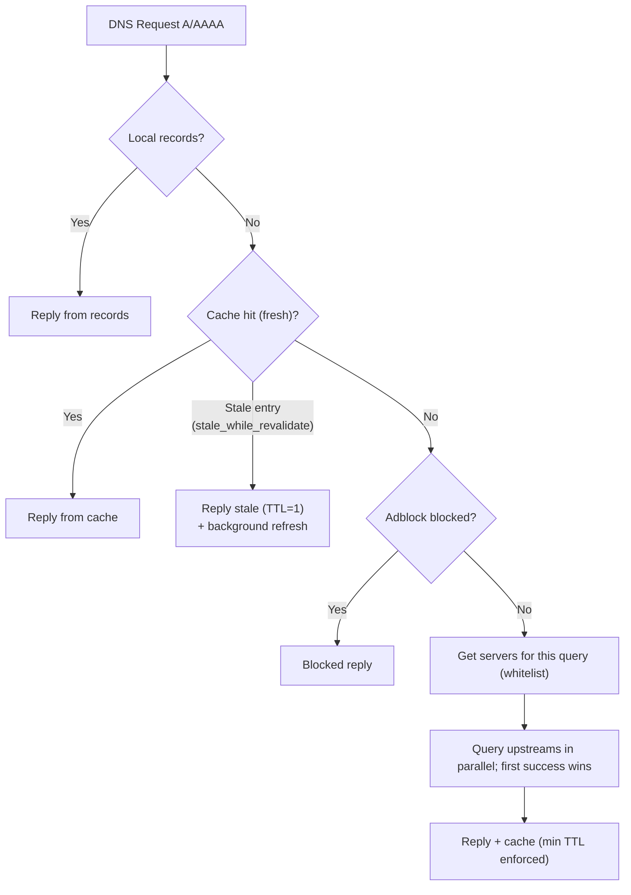

# Resolution behavior

dnsplane resolves DNS queries as described below. For host OS tuning see [host-tuning.md](host-tuning.md).

## How queries are answered

- **Fast path (A, AAAA, MX, …):** Try **local records**, then **cache** (if enabled). If neither applies, query **all upstreams in parallel** and use the **first successful** answer; slower or duplicate upstream work is cancelled once a winner returns.
- **PTR:** Local first (full scan + optional **A**→PTR synthesis), then the same fast path if no local answer.
- **Priority:** Local > cache > first upstream success.
- **Recursive resolvers:** Public resolvers (e.g. 1.1.1.1) return a usable answer quickly; dnsplane uses the first successful upstream response rather than waiting for a different resolution path, which keeps typical latency low.
- **Reply path:** The client gets an answer as soon as it is ready. Logging, stats, and saving the cache file happen in the background and do not delay the reply.
- **Cache behavior:** On a hit, local and cache are checked before any upstream work. **`min_cache_ttl_seconds`** (default 600) avoids caching answers with very short TTLs as-is. **`stale_while_revalidate`** can serve a stale answer immediately (TTL=1) while refreshing from upstream in the background.
- **Cache warm:** With **`cache_warm_enabled`** on (default), the server sends a periodic lightweight query to itself so idle systems stay responsive (**`cache_warm_interval_seconds`**, default 10).
- **Cache compaction:** With **`cache_compact_enabled`** on (default) and **`cache_records`** on, expired rows are removed from the cache on a schedule (**`cache_compact_interval_seconds`**, default 1800s; minimum 60). The dashboard can show cache size and the next compaction when this is enabled.
- **A/AAAA vs adblock:** Local and cache are checked **before** the blocklist so a cache hit does not run the blocklist. After a cache miss, blocked names still get the block reply. If a name is blocked but already has a **positive** cache entry, that answer is served until TTL (flush cache if you need the blocklist to take effect immediately).
- **Domain whitelist (per-server):** An upstream can have an optional **domain whitelist**. If set, that server is used **only** for query names that match one of the listed suffixes (exact or subdomain). For example, a server with whitelist `example.com,example.org` receives only queries for those domains and their subdomains; all other queries use only “global” upstreams (servers with no whitelist). Whitelisted domains are resolved **only** via those servers (no fallback to global upstreams). In the TUI: `dns add 192.168.5.5 53 active:true localresolver:true adblocker:false whitelist:example.com,example.org`.

## Diagram

Resolution flow including adblock, local records (file/URL/git), cache, per-server domain whitelist, and fallback:

## Diagram notes

- **Adblock (A/AAAA):** After local/cache miss, the name is checked against the block list; if blocked, no upstream is used.
- **Local records:** Loaded from `records_source` (file, URL, or Git). If a record matches, that reply is used and upstreams are not queried.
- **Cache:** If caching is enabled and the answer is still valid, it is returned without querying upstreams. When `stale_while_revalidate` is enabled, expired entries are served immediately (TTL=1) while a background refresh runs against upstream.
- **Min TTL:** Upstream answers are cached with `max(original TTL, min_cache_ttl_seconds)` so short-TTL domains don't cause frequent cache misses.
- **Server selection:** For each query name, dnsplane chooses upstreams with a matching **domain whitelist** if any; otherwise it uses only “global” upstreams (no whitelist). Names that match a whitelist are sent only to those servers.
- **Upstreams:** First successful reply wins for the fast path (all QTYPEs above).
